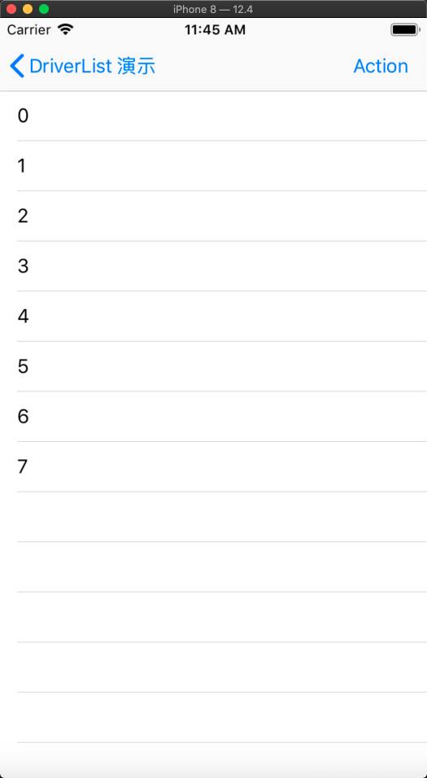
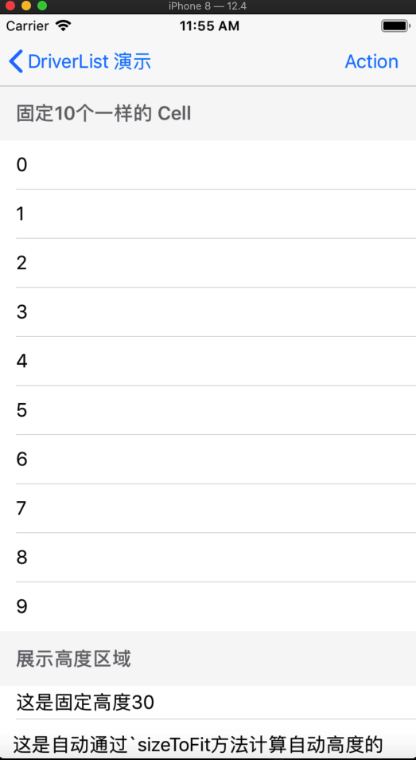
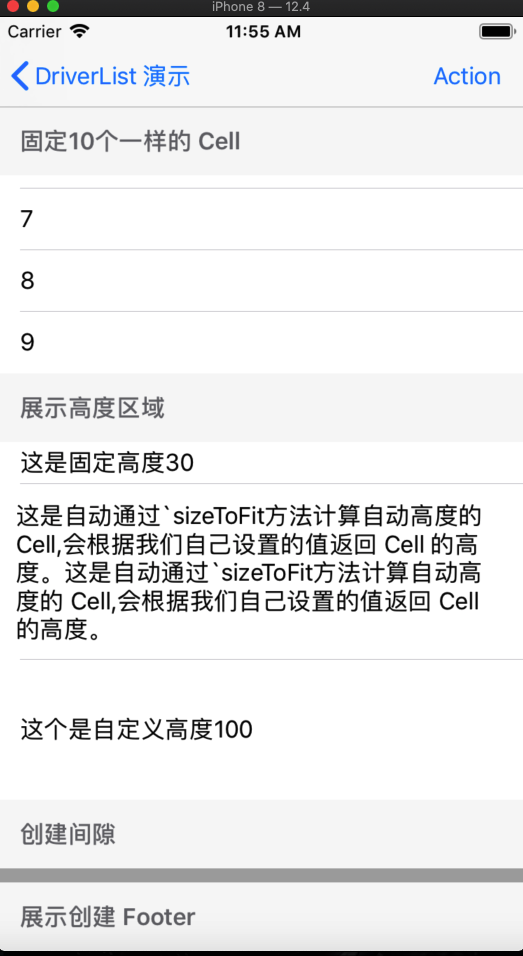
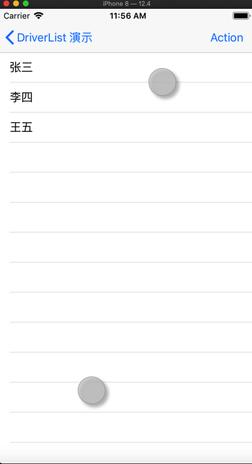

---
filename:images
---


## Swift 版本请移步[这里](https://github.com/josercc/SwiftTableViewGroup)

###  DriverListNode为 UITableView和 UICollectionView 而生

> `ZHTableViewGroup`已经更名为`DriverListNode`

## 演示

### 简单的 UITableView



```objc
NSUInteger count = arc4random() % 10 + 1;
tableView.driverData(MakeDriverGroup {
    list.makeGroup(MakeDriverNode {
        group.makeCell(ZHDriverNode(MakeDriverBlock(UITableViewCell) {
            [content setConfigBlock:^(UITableViewCell * _Nonnull view, NSUInteger index) {
                view.textLabel.text = [@(index) stringValue];
            }];
        }))
        .number(count)
        .height(44);
    });
});
```

### 复杂的 UITableView





```objc
tableView.driverData(MakeDriverGroup {
  list.makeGroup(MakeDriverNode {
      group.makeHeader(ZHDriverNode(MakeDriverBlock(UITableViewHeaderFooterView) {
          [content setConfigBlock:^(UITableViewHeaderFooterView * _Nonnull view, NSUInteger index) {
              view.textLabel.text = @"固定10个一样的 Cell";
          }];
      }))
      .height(49);

      group.makeCell(ZHDriverNode(MakeDriverBlock(UITableViewCell) {
          [content setConfigBlock:^(UITableViewCell * _Nonnull view, NSUInteger index) {
              view.textLabel.text = [@(index) stringValue];
          }];
      }))
      .height(44)
      .number(10);
  });

  list.makeGroup(MakeDriverNode {
      group.makeHeader(ZHDriverNode(MakeDriverBlock(UITableViewHeaderFooterView) {
          [content setConfigBlock:^(UITableViewHeaderFooterView * _Nonnull view, NSUInteger index) {
              view.textLabel.text = @"展示高度区域";
          }];
      }))
      .height(49);

      group.makeCell(ZHDriverNode(MakeDriverBlock(UITableViewCell) {
          [content setConfigBlock:^(UITableViewCell * _Nonnull view, NSUInteger index) {
              view.textLabel.text = @"这是固定高度30";
          }];
      }))
      .height(30);

      group.makeCell(ZHDriverNode(MakeDriverBlock(AutomitcHeightCell) {
          [content setConfigBlock:^(AutomitcHeightCell * _Nonnull view, NSUInteger index) {
              view.multiLineLabel.text = @"这是自动通过`sizeToFit方法计算自动高度的 Cell,会根据我们自己设置的值返回 Cell 的高度。这是自动通过`sizeToFit方法计算自动高度的 Cell,会根据我们自己设置的值返回 Cell 的高度。";
          }];
      }));

      group.makeCell(ZHDriverNode(MakeDriverBlock(UITableViewCell) {
          [content setConfigBlock:^(UITableViewCell * _Nonnull view, NSUInteger index) {
              view.textLabel.text = @"这个是自定义高度100";
          }];
          [content setCustomHeightBlock:^CGFloat(UITableViewCell * _Nonnull view, NSUInteger index) {
              return 100;
          }];
      }))
      .height(50);
  });

  list.makeGroup(MakeDriverNode {
      group.makeHeader(ZHDriverNode(MakeDriverBlock(UITableViewHeaderFooterView) {
          [content setConfigBlock:^(UITableViewHeaderFooterView * _Nonnull view, NSUInteger index) {
              view.textLabel.text = @"创建间隙";
          }];
      }))
      .height(49);

      group.makeSpeacer(UIColor.lightGrayColor);

      group.makeFooter(ZHDriverNode(MakeDriverBlock(UITableViewHeaderFooterView) {
          [content setConfigBlock:^(UITableViewHeaderFooterView * _Nonnull view, NSUInteger index) {
              view.textLabel.text = @"展示创建 Footer";
          }];
      }))
      .height(49);
  });
});
```

### 可变数据 UITableView



```objc
tableView.driverData(MakeDriverGroup {
  list.makeGroup(MakeDriverNode {
      group.makeCell(ZHDriverNode(MakeDriverBlock(UITableViewCell) {
          [content setConfigBlock:^(UITableViewCell * _Nonnull view, NSUInteger index) {
              view.textLabel.text = texts[index];
          }];
      }))
      .number(texts.count)
      .height(44);
  });
});
```

### 简单的 UICollectionView

```objc
collectionView.driverData(MakeDriverGroup {
  list.makeGroup(MakeDriverNode {
      group.makeHeader(ZHDriverNode(MakeDriverBlock(UICollectionReusableView) {
          [content setConfigBlock:^(UICollectionReusableView * _Nonnull view, NSUInteger index) {
              view.backgroundColor = [UIColor lightGrayColor];
          }];
      }))
      .size(CGSizeMake(CGRectGetWidth(collectionView.frame), 49));

      group.makeCell(ZHDriverNode(MakeDriverBlock(UICollectionViewCell) {
          [content setConfigBlock:^(UICollectionViewCell * _Nonnull view, NSUInteger index) {
              view.backgroundColor = index % 2 == 0 ? [UIColor redColor] : [UIColor greenColor];
          }];
      }))
      .size(CGSizeMake(100, 100))
      .number(100);

      group.makeFooter(ZHDriverNode(MakeDriverBlock(UICollectionReusableView) {
          [content setConfigBlock:^(UICollectionReusableView * _Nonnull view, NSUInteger index) {
              view.backgroundColor = [UIColor darkGrayColor];
          }];
      }))
      .size(CGSizeMake(CGRectGetWidth(collectionView.frame), 49));
  })
  .sectionEdgeInsets(UIEdgeInsetsMake(20, 20, 20, 20));
});
```


## 怎么安装

### Cocoapods

```ruby
pod 'DriverListNode'
```

### Carthage

```ruby
github "josercc/ZHTableViewGroup"
```


