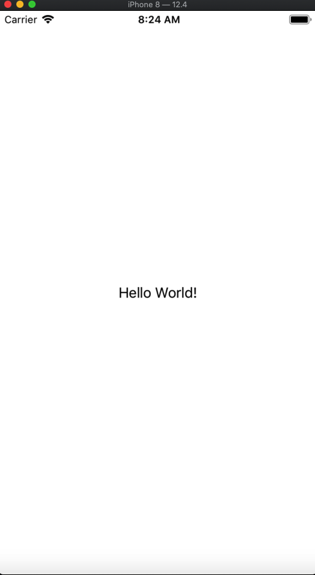
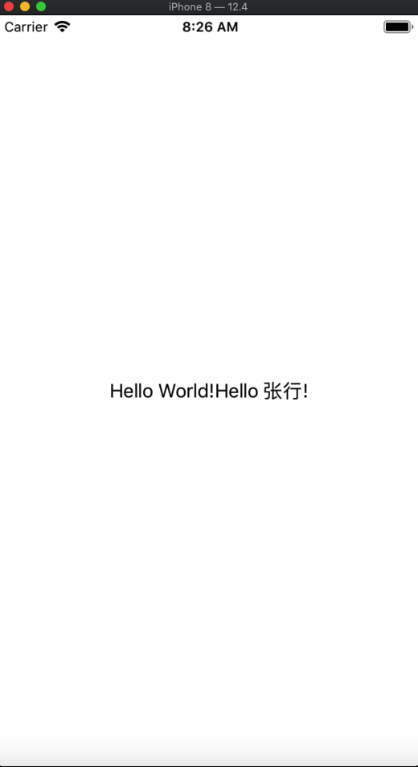
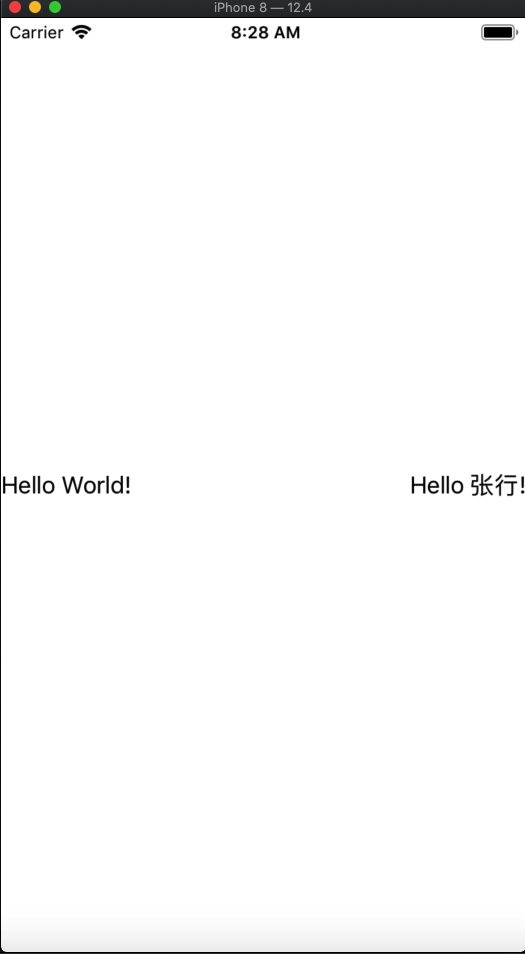
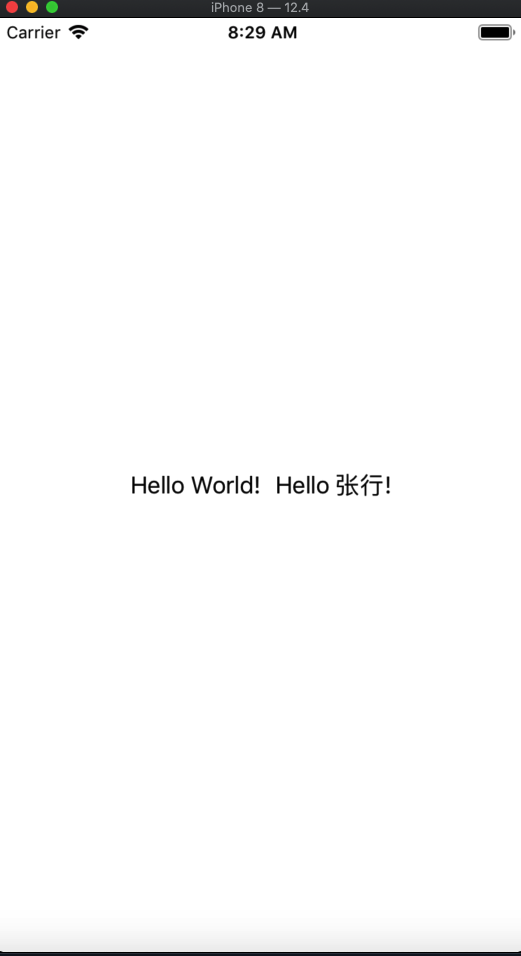
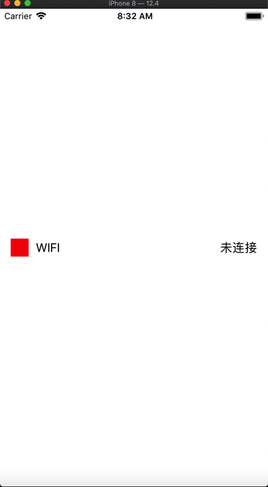
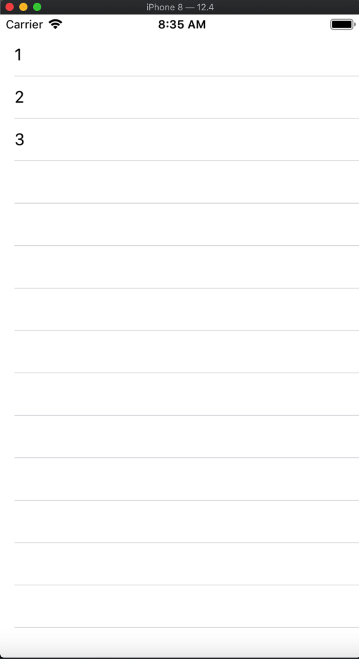

# 最新 OCUI 进展

## ⚠️⚠️⚠️⚠️⚠️Wraning: OCUI正处于测试阶段 最终 Api会尽可能的保持一致，但不保证能完全一样，因为 OC 限制太多。

## 文本横向居中

```objc
HStack(^{
    Text(@"Hello World!");
});
```



## 两个文本居中对齐

```objc
HStack(^{
    Text(@"Hello World!");
    Text(@"Hello 张行!");
});
```



## 两个文本居左对齐

```objc
HStack(^{
    Text(@"Hello World!");
    Spacer(nil);
    Text(@"Hello 张行!");
});
```



## 两个文本居中间隙为10

```objc
HStack(^{
    Text(@"Hello World!");
    Spacer(@10);
    Text(@"Hello 张行!");
});
```



## 快速创建设置 Cell

```objc
HStack(^{
    Spacer(@15);
    Image(nil)
        .size(CGSizeMake(25, 25))
        .backgroundColor([UIColor redColor]);
    Spacer(@10);
    Text(@"WIFI");
    Spacer(nil);
    Text(@"未连接");
    Spacer(@15);
});
```



## 创建一个简单的列表

```objc
HStack(^{
    List(self.bind, ^id<OCUIRenderView> _Nonnull{
        return UITableViewCell.self;
    })
    .config(^(UITableViewCell *cell, NSUInteger index) {
        cell.textLabel.text = self.bind.wrappedContent[index];
    });
});
```




